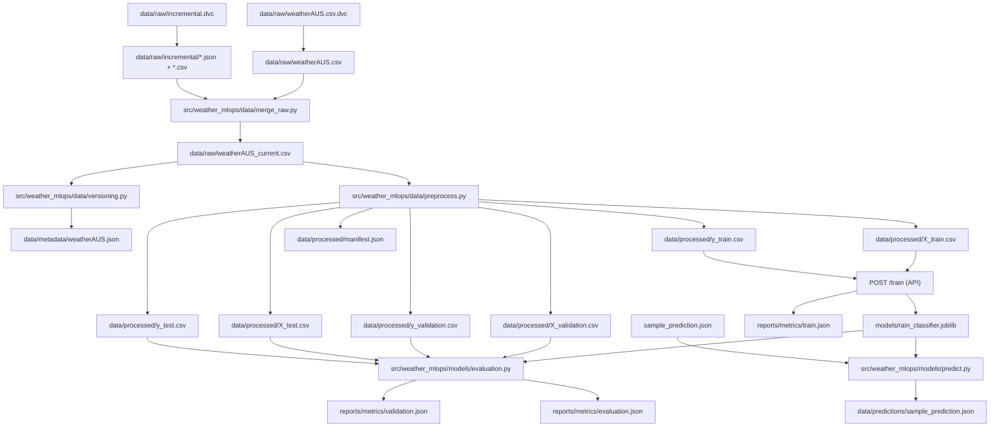

# Australian Weather MLOps

Predict `RainTomorrow` from Australian weather data. Code lives in Git. Dataset
files live in Supabase Storage. Postgres keeps the catalog. The FastAPI service
serves the model. Nginx is the public edge. Streamlit is the short live demo.

The app runtime is **Docker Compose**. DVC stays on the host because it writes
Git-tracked pointers and a local cache. MLflow tracking is an opt-in Compose
profile (`make mlflow`, also started by `make up`). Airflow is not in this branch.

## What it does

| Piece | Role |
| --- | --- |
| FastAPI | `/health`, `/predict`, `/predict/live_data`, `/train` |
| HTTP Basic Auth | Protects predict and train. `/health` stays open. |
| Nginx (`make api` / `make up`) | Public TLS edge. The API is not published on the host. |
| Streamlit (`make streamlit`) | Three-screen deck that calls Nginx with the same basic auth |
| Supabase Vault | Stores S3 keys and API basic auth. Hydrated from `SUPABASE_URL` + `SUPABASE_KEY` |
| `dataset_versions` | Production lineage: sha256 identity, snapshot URI, git commit |
| DVC (`no_scm`) | Developer restore (`make dvc-pull`). Not the production catalog. |
| MLflow (`make up` / `make mlflow`) | Tracking + registry. Artifacts in `s3://weather-mlops-mlflow`. API serves the `champion` alias. |

A typical call:

1. Client sends `POST https://localhost/predict` with `Authorization: Basic ...`
   (Nginx).
2. Nginx applies per-IP rate limits, then proxies to FastAPI on the Compose network.
3. FastAPI checks `API_AUTH_USER` / `API_AUTH_PASSWORD` (from Vault).
4. Wrong or missing credentials → **401**. Missing Vault auth secrets fail
   startup (or **503** if they disappear after the process is already up).
5. Valid request → the `champion` model from MLflow, or `best_model.joblib`.
   Missing model → **404**. `/train` is rate-limited tighter than predict.

Streamlit never receives `SUPABASE_KEY`. `make streamlit` hydrates basic auth
from Vault on the host and passes only that pair into the Streamlit container.

## Commands

Jobs (ingestion, preprocess, test, train) start, do the work, and exit.
Long-running services (API, Nginx, Streamlit) start detached. Follow them with
`make logs` (`SERVICE=nginx` or `SERVICE=streamlit` if needed).

| You want | Command |
| --- | --- |
| Restore the shared baseline | `make dvc-config && make dvc-pull && make api` |
| Refresh Open-Meteo, rebuild splits, serve over HTTPS | `make up` |
| Tests (ruff + pytest, including live Nginx) | `make test` |
| Retrain, then held-out metrics | `make pipeline` |
| Public HTTPS + rate limits | `make gateway` |
| Streamlit on `127.0.0.1:8501` | `make streamlit` |
| MLflow UI on `127.0.0.1:8080` | `make mlflow` |
| Follow logs / stop | `make logs` / `make down` |

One-shot extras, still Compose: `make train`, `make validate`, `make evaluate`,
`make compare`, `make predict`, `make fetch-open-meteo OPEN_METEO_DATE=YYYY-MM-DD`,
`make register-dataset`, `make load-db`. Dry-run catalog or DB load with
`ARGS='--dry-run'`.

Host-only DVC (not Compose): `make dvc-config`, `make dvc-pull`,
`make dvc-push`, `make dvc-repro`, `make dvc-add-model`, `make dvc-commit`.

## Local `.env`

Copy the example, then paste the two shared Supabase values from the team chat.
Do not commit `.env`.

```bash
cp .env.example .env
```

Required:

```text
SUPABASE_URL=https://<project-ref>.supabase.co
SUPABASE_KEY=<supabase-service-role-or-sb_secret-key>
```

Everything else is in Vault under the same names:

```text
AWS_ACCESS_KEY_ID
AWS_SECRET_ACCESS_KEY
API_AUTH_USER
API_AUTH_PASSWORD
```

The API container only receives the two bootstrap values and hydrates auth at
startup. Rotate a Vault secret, then restart the API container (`make api`).
Hydration is a startup snapshot, not live reload.

Do not put `API_AUTH_USER` / `API_AUTH_PASSWORD` in `.env`. Compose only needs
them for `make streamlit`, which copies the pair from Vault into the Streamlit
container. Other compose commands use empty defaults so they do not warn.

`make dvc-config` writes S3 keys in plaintext to ignored `.dvc/config.local`.
Keep that file local and restrictive (`chmod 600`).

The public URL is Nginx (`https://127.0.0.1`, self-signed). The API is not
published on the host. If Vault has no `API_AUTH_USER` / `API_AUTH_PASSWORD`
yet, the API process will not start.

## Workflows

### Restore the published baseline

Teammates should restore artifacts, not rebuild them:

```bash
cp .env.example .env          # SUPABASE_URL + SUPABASE_KEY only
make dvc-config
make dvc-pull
make test                     # ruff + pytest, including live Nginx through the gateway
make api                      # API + Nginx, detached
curl -k https://127.0.0.1/health
```

`make dvc-pull` downloads the DVC-versioned raw data, processed splits,
manifest, API model (`models/rain_classifier.joblib.dvc`), and metrics. That is
the shared baseline.

### Refresh data (optional)

`make up` runs MLflow, then ingestion, preprocess, the API, and Nginx. The two
jobs exit when they finish. Pin the fetch date with `OPEN_METEO_DATE=YYYY-MM-DD`.

```bash
make up
make register-dataset
make logs                     # API is already in the background
```

`make dvc-repro` is the DVC-only variant (merge + version + preprocess, no
Docker jobs). Use it when publishing lock hashes, not as the daily runtime.

### Train and evaluate

```bash
make up                       # MLflow + ingestion → preprocess → API + Nginx
make api                      # if the splits already exist: MLflow + API + Nginx
make pipeline                 # train → validate → compare (champion) → evaluate
```

`/train` returns training-set metrics and, when MLflow is up, registers a
candidate with dataset sha256 and git commit. `make compare` keeps the
`champion` alias on the best `validation_roc_auc` that also meets recall ≥ 0.75,
and copies that joblib to `best_model.joblib`. The API loads that alias first.
Held-out numbers come from validate and evaluate. The individual steps are
still `make train`, `make validate`, `make compare`, `make evaluate`.

### Publish a new baseline

After you intend the local artifacts to become the team restore point:

```bash
make dvc-repro
make pipeline
make register-dataset
make dvc-add-model
make dvc-commit
make dvc-push
git add dvc.lock models/rain_classifier.joblib.dvc reports/metrics/train.json.dvc
```

Commit the updated DVC pointers with the code. Verify from an empty `data/`
and `models/` with `make dvc-pull`.

### Nginx gateway

`make up` and `make api` start Nginx in front of the API. There is no host
port on the API itself.

```bash
make api
make test-gateway
```

- Port 80 redirects to HTTPS.
- Port 443 terminates TLS (self-signed cert generated at container start).
- Predict routes: 10 requests/second per IP, burst 20.
- `/train`: 1 request/second per IP, burst 3.
- Security headers (HSTS, nosniff, deny framing).
- `/docs` and `/redoc` use a looser CSP so Swagger UI can load.

Basic auth is still checked by FastAPI behind Nginx. Nginx does not replace it.
MLflow stays on `127.0.0.1:8080` and is **not** routed through Nginx.

### Streamlit

```bash
make streamlit
```

Then open `http://127.0.0.1:8501`. Three screens: architecture, stores, live
predict. The live screen calls Nginx (`https://nginx`), which proxies `/health`
and `/predict/live_data`.

### Dataset catalog

Hash a local file, upload an immutable snapshot to `s3://weather-mlops-dvc`,
and upsert `dataset_versions`:

```bash
make register-dataset
```

Identity is **sha256**. Uploading the same object twice is a no-op. Keys look
like `raw/<sha>/...` and `processed/<sha>/...`. Default `--kind all` registers
the raw CSV plus the six processed splits and `manifest.json` under one
combined CSV hash. That hash is the same `dataset_sha256` training records.

Observation identity is `(date, location)`. Apply
`supabase/migrations/20260915140000_observation_identity.sql` in the shared
SQL editor before the next `make load-db` on that project.

## API contract

| Method | Path | Auth | Notes |
| --- | --- | --- | --- |
| `GET` | `/health` | none | Docker healthcheck. Body includes the serving `model` (champion alias + version) |
| `POST` | `/predict` | basic | location + at least 3 weather fields. Response includes the same `model` object |
| `POST` | `/predict/live_data` | basic | location only; fetches Open-Meteo |
| `POST` | `/train` | basic | retrains, writes `models/rain_classifier.joblib` |

Compose injects `SUPABASE_URL` and `SUPABASE_KEY` into the API container. The
API hydrates `API_AUTH_USER` / `API_AUTH_PASSWORD` from Vault. The Streamlit
container gets the auth pair (via `make streamlit`) and
`DEMO_API_URL=https://nginx`. It does **not** get `SUPABASE_KEY`.

## Repository layout

```text
src/weather_mlops/
  api/            FastAPI app (Gabriel's basic auth + Vault hydrate)
  config/         Shared settings
  data/           Preprocess, DVC metadata, catalog, snapshots
  demo/           Streamlit deck
  models/         Train, evaluate, predict
  security/       Vault helper only (no JWT)
docker/
  api/            API image (copies src/ + scripts/)
  nginx/          TLS + rate limits
  demo/           Streamlit image
  test/           pytest image
  ingestion/      One-shot ingest job
  preprocess/     One-shot preprocess job
scripts/          One-time helpers (DVC remote, catalog, loaders)
supabase/         schema.sql + migrations
tests/unit/       Config and auth checks (nginx.conf, compose, Vault, catalog)
```

## Data flow (developer machine)

Git does not store the CSVs. DVC does. Production lineage is Postgres.



The Kaggle CSV is a historical seed. Fresh days come from Open-Meteo:

```bash
make fetch-open-meteo OPEN_METEO_DATE=2026-09-01
make dvc-commit
make dvc-repro
make dvc-push
```

Use a fully observed historical date (usually two days ago), because
`RainTomorrow` needs the next day's rain. Later, Airflow will own that loop.

## Supabase

Shared project schema is in `supabase/schema.sql` and
`supabase/migrations/`. Current tables/buckets used here:

- `weather_observations` — queryable rows
- `dataset_versions` — snapshot catalog (sha256, storage URI, lineage)
- `ingestion_batches`
- private bucket `weather-mlops-dvc`
- Vault RPC `public.get_app_secret` — reads S3 keys and API basic auth at startup
- `weather-mlops-mlflow` private bucket — MLflow model artifacts (joblib, sklearn
  flavor, lineage.json). Tracking metadata stays in the MLflow sqlite volume.

## CI

On pushes and pull requests to `master` / `main`:

- Host: `uv sync --locked --all-groups`, ruff, pytest
- Docker: build images, start API + Nginx, run `make test` (unit + live TLS/429)

