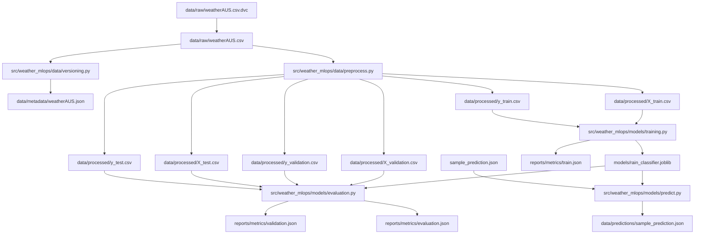

# Australian Weather MLOps

Early-stage MLOps project for predicting `RainTomorrow` from the Australian
weather dataset.

This branch keeps the scope intentionally small: reproducible environment,
Supabase setup, DVC versioning, preprocessing, XGBoost training, evaluation,
and sample prediction. API work, security, nginx, Docker, Docker Compose,
Airflow, MLflow, monitoring, and dashboards are later stages.

## What Changed

- Replaced the old scaffold with a minimal package under `src/weather_mlops`.
- Added a locked `uv` environment through `pyproject.toml`, `uv.lock`, and
  `.python-version`.
- Added one shared Supabase schema at `sql/supabase_schema.sql`.
- Added DVC without Git integration, with Supabase Storage as the S3-compatible
  remote.
- Added a reproducible DVC DAG for dataset metadata, preprocessing, training,
  evaluation, and prediction.
- Added XGBoost training and prediction scripts under `src/weather_mlops/models`.
- Added lightweight JSON metrics and prediction artifacts instead of MLflow.
- Removed unused scaffold folders, API placeholders, monitoring placeholders,
  Docker files (will add later).

The real `.env` file is not committed because GitHub push protection blocks
Supabase secrets. Use `.env.example` for the required variable names, then get
the real shared values from the team chat and put them in your local `.env`.
Do not commit `.env`.

## Repository Structure

```text
.
+-- src/weather_mlops/
|   +-- config/                 # Shared settings
|   +-- data/                   # Preprocessing, DVC metadata, DB helpers
|   +-- models/                 # Training, evaluation, prediction
+-- scripts/                    # One-time local helpers
+-- tests/unit/                 # Focused unit tests
+-- sql/supabase_schema.sql     # Supabase tables and Storage bucket
+-- data/                       # Local DVC outputs, ignored by Git
+-- models/                     # Local model artifact, ignored by Git
+-- reports/metrics/            # DVC metric outputs, ignored by Git
+-- dvc.yaml                    # Reproducible pipeline DAG
+-- dvc.lock                    # Current DVC artifact hashes
+-- params.yaml                 # Pipeline parameters
+-- Makefile                    # Common local entry points
+-- pyproject.toml              # uv dependencies and tool config
+-- requirements.txt            # Exported dependency snapshot for compatibility
+-- uv.lock                     # Locked uv environment
```

## Data Flow

The raw Kaggle CSV was downloaded once, added to DVC, and pushed to the
Supabase Storage remote. Teammates should not need to download from Kaggle in
the normal workflow; `make pull` restores the DVC-tracked artifacts from
Supabase.

The active reproducible flow is:

1. DVC restores `data/raw/weatherAUS.csv`.
2. `weather_mlops.data.versioning` writes file size, MD5, and SHA256 metadata.
3. `weather_mlops.data.preprocess` cleans the raw rows, sorts by date, removes
   `Date` from model features, maps `RainTomorrow` to `0/1`, and writes
   chronological train/validation/test feature and label splits.
4. `weather_mlops.models.training` trains only from `X_train.csv` and
   `y_train.csv`, then writes the model artifact and training metrics.
5. `weather_mlops.models.evaluation` evaluates the saved model on validation
   and test splits.
6. `weather_mlops.models.predict` loads the saved model and predicts one JSON
   sample. This is the function the future API can call.



## Supabase State

Supabase is already initialized for this branch. The SQL used for that setup is
kept in `sql/supabase_schema.sql` so the team can recreate the same tables and
bucket if a new Supabase project is needed later.

The schema creates:

- `public.weather_observations`
- `public.dataset_versions`
- private Storage bucket `weather-mlops-dvc`

## Local Secrets

The repository tracks `.env.example`, not `.env`.

After pulling the branch, create your local `.env` manually:

```bash
cp .env.example .env
```

Then open `.env` and replace every placeholder with the shared Supabase values
from the team chat. The values that must be filled manually are:

- `SUPABASE_URL`
- `SUPABASE_KEY`
- `SUPABASE_S3_ENDPOINT`
- `AWS_ACCESS_KEY_ID`
- `AWS_SECRET_ACCESS_KEY`

Keep the table names, DVC remote name, DVC bucket URL, region, and split
fractions as they are unless the team intentionally changes the project setup.

Do not push real `.env` values to GitHub. `.env` is ignored by Git, and
`.dvc/config.local` is also ignored because it stores the local DVC remote
credentials after `make dvc-config`.

The tracked `.env.example` contains the required variable names:

```text
SUPABASE_URL=https://<project-ref>.supabase.co
SUPABASE_KEY=<supabase-secret-key>
SUPABASE_WEATHER_TABLE=weather_observations
SUPABASE_DATASET_VERSIONS_TABLE=dataset_versions
DVC_REMOTE_NAME=supabase
DVC_REMOTE_URL=s3://weather-mlops-dvc
SUPABASE_S3_ENDPOINT=https://<project-ref>.storage.supabase.co/storage/v1/s3
AWS_ACCESS_KEY_ID=<supabase-storage-access-key-id>
AWS_SECRET_ACCESS_KEY=<supabase-storage-secret-access-key>
AWS_DEFAULT_REGION=eu-west-1
RANDOM_STATE=42
TRAIN_FRACTION=0.7
VALIDATION_FRACTION=0.15
```

`SUPABASE_KEY` is the shared Supabase server-side key used by the Python loader
to write database rows.
`AWS_ACCESS_KEY_ID` and `AWS_SECRET_ACCESS_KEY` come from Supabase Storage >
Configuration > S3 and are used by DVC.

Supabase Postgres stores queryable rows and dataset metadata. Supabase Storage
stores DVC objects. DVC provides versioning by hashing artifacts and pushing
content-addressed files to the Storage bucket.

## After Pulling

Run this from the repository root:

```bash
uv sync
cp .env.example .env
# manually paste the shared Supabase values into .env
make dvc-config
make pull
make repro
make check
```

`make dvc-config` writes DVC credentials to `.dvc/config.local` with
`dvc remote modify --local`. That file is generated locally and ignored by Git.

`make pull` downloads the DVC-versioned raw data, processed data, model,
metrics, and prediction artifacts from Supabase Storage.

`make repro` reruns the DAG from `dvc.yaml`. If nothing changed, DVC should
report that every stage is unchanged.

## Useful Commands

```bash
make check      # lint, format check, unit tests
make repro      # run the DVC pipeline
make pull       # pull DVC artifacts from Supabase Storage
make push       # push DVC artifacts to Supabase Storage
make train      # run training directly
make validate   # evaluate the model on the validation split
make evaluate   # run evaluation directly
make predict    # write sample prediction JSON
make load-db    # load raw weather rows and metadata into Supabase Postgres
```

The one-time Kaggle helper is outside `src` because it is not part of the
reproducible runtime pipeline:

```bash
uv run --with kaggle python scripts/download_weatheraus_from_kaggle.py
```

To validate Supabase table compatibility without writing rows:

```bash
uv run python scripts/load_to_supabase.py --dry-run
```

To inspect the current DVC state:

```bash
uv run dvc status
uv run dvc status -c
uv run dvc metrics show
```

## Current Supabase Metadata

The raw dataset has been loaded once with repo-relative metadata:

```text
dataset_name: weatherAUS
path: data/raw/weatherAUS.csv
md5: a65cf8b8719b1a65db4f361eeec18457
sha256: 573fd715cd69fcacc4df32024d823b450ae3edaae7e8ff2eeb623adbed424014
```

## Current Outputs

- `data/metadata/weatherAUS.json`
- `data/processed/X_train.csv`
- `data/processed/y_train.csv`
- `data/processed/X_validation.csv`
- `data/processed/y_validation.csv`
- `data/processed/X_test.csv`
- `data/processed/y_test.csv`
- `models/rain_classifier.joblib`
- `reports/metrics/train.json`
- `reports/metrics/validation.json`
- `reports/metrics/evaluation.json`
- `data/predictions/sample_prediction.json`

These files are ignored by Git and versioned through DVC.

## CI

GitHub Actions runs on pushes and pull requests to `master` or `main`:

- `uv sync --locked --all-groups`
- `ruff check .`
- `ruff format --check .`
- `pytest`

Docker build checks are intentionally not included yet because containerization
will be handled in a later project stage.

## Next Steps

- Keep reproducible ML code inside `src/weather_mlops/...`.
- Keep one-time local helpers inside `scripts/...`.
- Add API/security/nginx, Docker/Docker Compose, Airflow orchestration, MLflow,
  and monitoring only when those project stages start.
