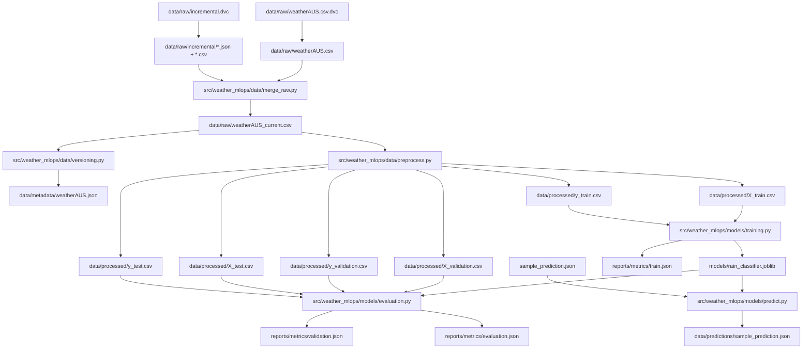

# Australian Weather MLOps

Early-stage MLOps project for predicting `RainTomorrow` from the Australian
weather dataset.

This branch keeps the scope intentionally small: reproducible environment,
Supabase setup, DVC versioning, preprocessing, XGBoost training, evaluation,
and sample prediction. API work, security, nginx, Docker, Docker Compose,
Airflow, MLflow, monitoring, and dashboards are later stages.

## What Changed

- Replaced the old scaffold with a minimal package under `src/weather_mlops`.
- Added a locked `uv` environment through `pyproject.toml`, `uv.lock`, and
  `.python-version`.
- Consolidated the Supabase setup into one shared schema at
  `supabase/schema.sql`.
- Added DVC without Git integration, with Supabase Storage as the S3-compatible
  remote.
- Added a reproducible DVC DAG for dataset metadata, preprocessing, training,
  evaluation, and prediction.
- Added a raw merge stage so the Kaggle seed dataset can be combined with
  future WeatherAUS-compatible incremental snapshots.
- Added an Open-Meteo fetcher that stores raw JSON responses and
  WeatherAUS-compatible CSV snapshots.
- Added XGBoost training and prediction scripts under `src/weather_mlops/models`.
- Added lightweight JSON metrics and prediction artifacts instead of MLflow.
- Removed unused scaffold folders, API placeholders, monitoring placeholders,
  Docker files (will add later).

The real `.env` file is not committed because GitHub push protection blocks
Supabase secrets. Use `.env.example` for the required variable names, then get
the real shared values from the team chat and put them in your local `.env`.
Do not commit `.env`.

## Repository Structure

```text
.
+-- src/weather_mlops/
|   +-- config/                 # Shared settings
|   +-- data/                   # Preprocessing, DVC metadata, DB helpers
|   +-- models/                 # Training, evaluation, prediction
+-- scripts/                    # One-time local helpers
+-- tests/unit/                 # Focused unit tests
+-- references/                 # Small tracked config files
+-- supabase/schema.sql         # Canonical Supabase schema
+-- supabase/migrations/        # Tracked Supabase migration SQL
+-- data/                       # Local DVC outputs, ignored by Git
+-- models/                     # Local model artifact, ignored by Git
+-- reports/metrics/            # DVC metric outputs, ignored by Git
+-- dvc.yaml                    # Reproducible pipeline DAG
+-- dvc.lock                    # Current DVC artifact hashes
+-- params.yaml                 # Pipeline parameters
+-- Makefile                    # Common local entry points
+-- pyproject.toml              # uv dependencies and tool config
+-- requirements.txt            # Exported dependency snapshot for compatibility
+-- uv.lock                     # Locked uv environment
```

## Data Flow

The raw Kaggle CSV was downloaded once, added to DVC, and pushed to the
Supabase Storage remote. Teammates should not need to download from Kaggle in
the normal workflow; `make pull` restores the DVC-tracked artifacts from
Supabase.

Fresh weather observations should enter the project as immutable snapshots
under `data/raw/incremental/`. Those snapshots are normalized to the same
WeatherAUS columns, versioned by DVC, and merged with the Kaggle seed into
`data/raw/weatherAUS_current.csv`. The model pipeline trains from that merged
current dataset.

The active reproducible flow is:

1. DVC restores `data/raw/weatherAUS.csv` and `data/raw/incremental/`.
2. `weather_mlops.data.merge_raw` writes `data/raw/weatherAUS_current.csv`.
3. `weather_mlops.data.versioning` writes file size, MD5, and SHA256 metadata
   for the merged current dataset.
4. `weather_mlops.data.preprocess` cleans the raw rows, sorts by date, removes
   `Date` from model features, maps `RainTomorrow` to `0/1`, and writes
   chronological train/validation/test feature and label splits.
5. `weather_mlops.models.training` trains only from `X_train.csv` and
   `y_train.csv`, then writes the model artifact and training metrics.
6. `weather_mlops.models.evaluation` evaluates the saved model on validation
   and test splits.
7. `weather_mlops.models.predict` loads the saved model and predicts one JSON
   sample. This is the function the future API can call.



## Fresh Weather Data

The original Kaggle file is a historical seed dataset. For fresh Australian
weather observations, use Open-Meteo because it provides public historical
weather access without a project API key for this early non-commercial stage,
JSON responses, global coordinate coverage, daily aggregates, and hourly
observations.

The fetch script queries the configured WeatherAUS locations in
`references/weather_locations.csv`. For each location and date it stores the raw
Open-Meteo JSON and a normalized WeatherAUS-compatible CSV snapshot under
`data/raw/incremental/`.

```bash
make fetch-open-meteo OPEN_METEO_DATE=2026-09-01
uv run dvc add data/raw/incremental
make repro
make push
```

Use a fully observed historical date. In practice, that usually means fetching
two days ago, because `RainTomorrow` for a given row depends on the following
day's rainfall.

Open-Meteo returns wind speeds in km/h when requested with
`wind_speed_unit=kmh`, matching WeatherAUS-style wind columns. Cloud cover is
converted from percent to oktas (`0`-`8`). Sunshine duration is converted from
seconds to hours. Evapotranspiration is mapped to the WeatherAUS `Evaporation`
column as the closest available daily proxy.

Later, Airflow should own the scheduled fetch step:

1. Run `make fetch-open-meteo OPEN_METEO_DATE=<yyyy-mm-dd>`.
2. Run `uv run dvc add data/raw/incremental`.
3. Run `make repro`.
4. Run `make push`.
5. Optionally run `make load-db` to update Supabase Postgres metadata and rows.

## Weather API Choice

We compared Open-Meteo, OpenWeather, and The Weather Company/Weather.com for
fresh weather ingestion.

Open-Meteo is the current choice because it keeps this phase simple:

- No API key is required for this early non-commercial workflow.
- Historical data is available through one archive endpoint.
- The endpoint returns JSON and downloadable CSV.
- It supports the hourly and daily variables needed to approximate the
  WeatherAUS columns: temperature, humidity, pressure, rain, cloud cover, wind
  speed, wind direction, wind gusts, sunshine duration, and evapotranspiration.
- It supports Australian coordinates directly, so we can fetch the same
  WeatherAUS locations listed in `references/weather_locations.csv`.

OpenWeather was not chosen for now because the useful endpoints for this
pipeline are under One Call API 3.0. Those endpoints support historical
timestamp and daily aggregation data, but they require a separate One Call
subscription/activation even though some calls may be free. That adds account
and billing setup before the team can reproduce the pipeline.

The Weather Company/Weather.com was not chosen for now because it is also
API-key based and oriented around provisioned trial or paid access. It has
strong enterprise weather products, but it adds more setup friction than we
need for the first reproducible local pipeline.

The tradeoff is that Open-Meteo values are model/reanalysis based at grid-cell
coordinates, while the Kaggle seed was built from station observations. That is
acceptable for this stage because the goal is to prove reproducible ingestion,
versioning, preprocessing, training, and evaluation. Later, the team can revisit
provider choice if station-level accuracy or enterprise data access becomes a
hard requirement.

References:

- [Open-Meteo Historical Weather API](https://open-meteo.com/en/docs/historical-weather-api)
- [OpenWeather One Call API 3.0](https://openweathermap.org/api/one-call-3)
- [The Weather Company API docs](https://developer.weather.com/docs/getting-started)

## Supabase State

Supabase is already initialized for this branch. The SQL used for that setup is
kept in `supabase/schema.sql`, with the matching migration tracked under
`supabase/migrations/`, so the team can recreate the same tables and bucket if
a new Supabase project is needed later.

The schema creates:

- `public.weather_observations`, using the WeatherAUS columns loaded by
  `scripts/load_to_supabase.py`
- `public.dataset_versions`, storing dataset path, size, MD5, SHA256, and
  creation time
- private Storage bucket `weather-mlops-dvc`, used as the DVC remote
- future tables for `public.model_versions`, `public.predictions`, and
  `public.drift_reports`

Gabriel's future-facing API, prediction, model, and drift tables are kept in
the shared schema. The current Phase 1 code writes only to
`weather_observations` and `dataset_versions`.

## Local Secrets

The repository tracks `.env.example`, not `.env`.

After pulling the branch, create your local `.env` manually:

```bash
cp .env.example .env
```

Then open `.env` and replace every placeholder with the shared Supabase values
from the team chat. The values that must be filled manually are:

- `SUPABASE_URL`
- `SUPABASE_KEY`
- `SUPABASE_S3_ENDPOINT`
- `AWS_ACCESS_KEY_ID`
- `AWS_SECRET_ACCESS_KEY`

Keep the table names, DVC remote name, DVC bucket URL, region, and split
fractions as they are unless the team intentionally changes the project setup.

Do not push real `.env` values to GitHub. `.env` is ignored by Git, and
`.dvc/config.local` is also ignored because it stores the local DVC remote
credentials after `make dvc-config`.

The tracked `.env.example` contains the required variable names:

```text
SUPABASE_URL=https://<project-ref>.supabase.co
SUPABASE_KEY=<supabase-secret-key>
SUPABASE_WEATHER_TABLE=weather_observations
SUPABASE_DATASET_VERSIONS_TABLE=dataset_versions
DVC_REMOTE_NAME=supabase
DVC_REMOTE_URL=s3://weather-mlops-dvc
SUPABASE_S3_ENDPOINT=https://<project-ref>.storage.supabase.co/storage/v1/s3
AWS_ACCESS_KEY_ID=<supabase-storage-access-key-id>
AWS_SECRET_ACCESS_KEY=<supabase-storage-secret-access-key>
AWS_DEFAULT_REGION=eu-west-1
RANDOM_STATE=42
TRAIN_FRACTION=0.7
VALIDATION_FRACTION=0.15
```

`SUPABASE_KEY` is the shared Supabase server-side key used by the Python loader
to write database rows.
`AWS_ACCESS_KEY_ID` and `AWS_SECRET_ACCESS_KEY` come from Supabase Storage >
Configuration > S3 and are used by DVC.

Supabase Postgres stores queryable rows and dataset metadata. Supabase Storage
stores DVC objects. DVC provides versioning by hashing artifacts and pushing
content-addressed files to the Storage bucket.

## After Pulling

Run this from the repository root:

```bash
uv sync
cp .env.example .env
# manually paste the shared Supabase values into .env
make dvc-config
make pull
make repro
make check
```

`make dvc-config` writes DVC credentials to `.dvc/config.local` with
`dvc remote modify --local`. That file is generated locally and ignored by Git.

`make pull` downloads the DVC-versioned raw data, processed data, model,
metrics, and prediction artifacts from Supabase Storage.

`make repro` reruns the DAG from `dvc.yaml`. If nothing changed, DVC should
report that every stage is unchanged.

## Inference API

A FastAPI service exposes the trained model for predictions and retraining.

Endpoints:
- `GET /health` reports whether the API is running and whether a trained model is available
- `POST /predict` predicts rain tomorrow from manually provided weather features (`location` and at least 3 weather conditions are required. The remaining fields are optional and missing values are imputed by the trained pipeline)
- `POST /predict/live_data` predicts rain tomorrow using live weather data fetched from Open-Meteo for the given location (only `location` is required)
- `POST /train` retrains the model with configurable XGBoost hyperparameters and returns evaluation metrics

Run locally:

    make api

Then open `http://127.0.0.1:8000/docs` for interactive API documentation.

## Useful Commands

```bash
make check      # lint, format check, unit tests
make repro      # run the DVC pipeline
make pull       # pull DVC artifacts from Supabase Storage
make push       # push DVC artifacts to Supabase Storage
make merge-raw  # merge Kaggle seed data with incremental raw snapshots
make train      # run training directly
make validate   # evaluate the model on the validation split
make evaluate   # run evaluation directly
make predict    # write sample prediction JSON
make fetch-open-meteo # fetch Open-Meteo JSON and normalized CSV snapshots
make load-db    # load raw weather rows and metadata into Supabase Postgres
make api        # start inference API locally with auto-reload
```

The one-time Kaggle helper is outside `src` because it is not part of the
reproducible runtime pipeline:

```bash
uv run --with kaggle python scripts/download_weatheraus_from_kaggle.py
```

To validate Supabase table compatibility without writing rows:

```bash
uv run python scripts/load_to_supabase.py --dry-run
```

To inspect the current DVC state:

```bash
uv run dvc status
uv run dvc status -c
uv run dvc metrics show
```

## Current Dataset Metadata

The current merged raw dataset has repo-relative metadata:

```text
dataset_name: weatherAUS
path: data/raw/weatherAUS_current.csv
md5: 06b1da4ba0778152250267b3ecab2f13
sha256: 5f9a9cff896cd4be2a358891943361c1caaaa4e26448703d5da2639ebe7e155e
```

## Current Outputs

- `data/raw/incremental/`
- `data/raw/weatherAUS_current.csv`
- `data/metadata/weatherAUS.json`
- `data/processed/X_train.csv`
- `data/processed/y_train.csv`
- `data/processed/X_validation.csv`
- `data/processed/y_validation.csv`
- `data/processed/X_test.csv`
- `data/processed/y_test.csv`
- `models/rain_classifier.joblib`
- `reports/metrics/train.json`
- `reports/metrics/validation.json`
- `reports/metrics/evaluation.json`
- `data/predictions/sample_prediction.json`

These files are ignored by Git and versioned through DVC.

## CI

GitHub Actions runs on pushes and pull requests to `master` or `main`:

- `uv sync --locked --all-groups`
- `ruff check .`
- `ruff format --check .`
- `pytest`

Docker build checks are intentionally not included yet because containerization
will be handled in a later project stage.

## Next Steps

- Keep reproducible ML code inside `src/weather_mlops/...`.
- Keep one-time local helpers inside `scripts/...`.
- Add API security/nginx, Docker/Docker Compose, Airflow orchestration, MLflow,
  and monitoring only when those project stages start.
