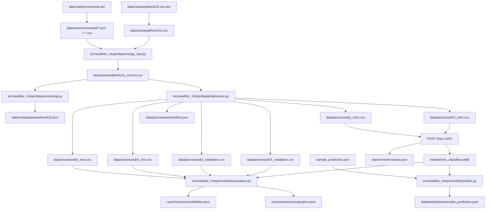

# Australian Weather MLOps

Predict `RainTomorrow` from Australian weather data. Code lives in Git. Dataset
files live in Supabase Storage. Postgres keeps the catalog. The FastAPI service
serves the model. Nginx is the public edge. Streamlit is the short live demo.

The app runtime is **Docker Compose**. DVC stays on the host because it writes
Git-tracked pointers and a local cache. MLflow and Airflow are **not** in this
branch.

## What it does

| Piece | Role |
| --- | --- |
| FastAPI | `/health`, `/predict`, `/predict/live_data`, `/train` |
| HTTP Basic Auth | Protects predict and train. `/health` stays open. |
| Nginx (`make gateway`) | TLS, HTTP→HTTPS, per-IP rate limits |
| Streamlit (`make streamlit`) | Three-screen deck that calls the API with the same basic auth |
| Supabase Vault | Stores S3 keys and API basic auth. Hydrated from `SUPABASE_URL` + `SUPABASE_KEY` |
| `dataset_versions` | Production lineage: sha256 identity, snapshot URI, git commit |
| DVC (`no_scm`) | Developer restore (`make dvc-pull`). Not the production catalog. |

A typical call:

1. Client sends `POST /predict` with `Authorization: Basic ...`.
2. FastAPI checks `API_AUTH_USER` / `API_AUTH_PASSWORD` (from Vault, copied into
   the process environment at startup).
3. Wrong or missing credentials → **401**. Missing Vault auth secrets fail
   startup (or **503** if they disappear after the process is already up).
4. Valid request → the joblib pipeline. Missing model → **404**.
5. If you put Nginx in front, rate limits hit **before** FastAPI. `/train` is
   tighter than predict.

Streamlit never receives `SUPABASE_KEY`. `make streamlit` hydrates basic auth
from Vault on the host and passes only that pair into the Streamlit container.

## Commands

Jobs (ingestion, preprocess, test, train) start, do the work, and exit.
Long-running services (API, Nginx, Streamlit) start detached. Follow them with
`make logs` (`SERVICE=nginx` or `SERVICE=streamlit` if needed).

| You want | Command |
| --- | --- |
| Restore the shared baseline | `make dvc-config && make dvc-pull && make api` |
| Refresh Open-Meteo, rebuild splits, serve | `make up` |
| Tests (ruff + pytest in `weather-test`) | `make test` |
| Retrain, then held-out metrics | `make pipeline` |
| Public HTTPS + rate limits | `make gateway` |
| Streamlit on `127.0.0.1:8501` | `make streamlit` |
| Follow logs / stop | `make logs` / `make down` |

One-shot extras, still Compose: `make train`, `make validate`, `make evaluate`,
`make predict`, `make fetch-open-meteo OPEN_METEO_DATE=YYYY-MM-DD`,
`make register-dataset`, `make load-db`. Dry-run catalog or DB load with
`ARGS='--dry-run'`.

Host-only DVC (not Compose): `make dvc-config`, `make dvc-pull`,
`make dvc-push`, `make dvc-repro`, `make dvc-add-model`, `make dvc-commit`.

## Local `.env`

Copy the example, then paste the two shared Supabase values from the team chat.
Do not commit `.env`.

```bash
cp .env.example .env
```

Required:

```text
SUPABASE_URL=https://<project-ref>.supabase.co
SUPABASE_KEY=<supabase-service-role-or-sb_secret-key>
```

Everything else is in Vault under the same names:

```text
AWS_ACCESS_KEY_ID
AWS_SECRET_ACCESS_KEY
API_AUTH_USER
API_AUTH_PASSWORD
```

The API container only receives the two bootstrap values and hydrates auth at
startup. Rotate a Vault secret, then restart the API container (`make api`).
Hydration is a startup snapshot, not live reload.

Do not put `API_AUTH_USER` / `API_AUTH_PASSWORD` in `.env`. Compose only needs
them for `make streamlit`, which copies the pair from Vault into the Streamlit
container. Other compose commands use empty defaults so they do not warn.

`make dvc-config` writes S3 keys in plaintext to ignored `.dvc/config.local`.
Keep that file local and restrictive (`chmod 600`).

The API port is localhost-only (`127.0.0.1:8000`). Public access goes through
Nginx. If Vault has no `API_AUTH_USER` / `API_AUTH_PASSWORD` yet, the API
process will not start.

## Workflows

### Restore the published baseline

Teammates should restore artifacts, not rebuild them:

```bash
cp .env.example .env          # SUPABASE_URL + SUPABASE_KEY only
make dvc-config
make dvc-pull
make test                     # ruff + pytest in the test container
make api                      # API only, detached on 127.0.0.1:8000
curl http://127.0.0.1:8000/health
```

`make dvc-pull` downloads the DVC-versioned raw data, processed splits,
manifest, API model (`models/rain_classifier.joblib.dvc`), and metrics. That is
the shared baseline.

### Refresh data (optional)

`make up` runs the ingestion job, then preprocess, then the API. The two jobs
exit when they finish. Pin the fetch date with `OPEN_METEO_DATE=YYYY-MM-DD`.

```bash
make up
make register-dataset
make logs                     # API is already in the background
```

`make dvc-repro` is the DVC-only variant (merge + version + preprocess, no
Docker jobs). Use it when publishing lock hashes, not as the daily runtime.

### Train and evaluate

```bash
make api                      # if it is not already up
make pipeline                 # POST /train, then validation, then test metrics
```

`/train` returns training-set metrics. Held-out numbers come from validate and
evaluate. The individual steps are still `make train`, `make validate`,
`make evaluate` if you want them one at a time.

### Publish a new baseline

After you intend the local artifacts to become the team restore point:

```bash
make dvc-repro
make pipeline
make register-dataset
make dvc-add-model
make dvc-commit
make dvc-push
git add dvc.lock models/rain_classifier.joblib.dvc reports/metrics/train.json.dvc
```

Commit the updated DVC pointers with the code. Verify from an empty `data/`
and `models/` with `make dvc-pull`.

### Nginx gateway

```bash
make gateway
```

- Port 80 redirects to HTTPS.
- Port 443 terminates TLS (self-signed cert generated at container start).
- Predict routes: 10 requests/second per IP, burst 20.
- `/train`: 1 request/second per IP, burst 3.
- Security headers (HSTS, nosniff, deny framing).
- `/docs` and `/redoc` use a looser CSP so Swagger UI can load.

Basic auth is still checked by FastAPI behind Nginx. Nginx does not replace it.

### Streamlit

```bash
make streamlit
```

Then open `http://127.0.0.1:8501`. Three screens: architecture, stores, live
predict. The live screen calls `/health` (open) and `/predict/live_data`
(basic auth hydrated from Vault by `make streamlit`).

### Dataset catalog

Hash a local file, upload an immutable snapshot to `s3://weather-mlops-dvc`,
and upsert `dataset_versions`:

```bash
make register-dataset
```

Identity is **sha256**. Uploading the same object twice is a no-op. Keys look
like `raw/<sha>/...` and `processed/<sha>/...`. Default `--kind all` registers
the raw CSV plus the six processed splits and `manifest.json` under one
combined CSV hash. That hash is the same `dataset_sha256` training records.

Observation identity is `(date, location)`. Apply
`supabase/migrations/20260915140000_observation_identity.sql` in the shared
SQL editor before the next `make load-db` on that project.

## API contract

| Method | Path | Auth | Notes |
| --- | --- | --- | --- |
| `GET` | `/health` | none | Docker healthcheck uses this |
| `POST` | `/predict` | basic | location + at least 3 weather fields |
| `POST` | `/predict/live_data` | basic | location only; fetches Open-Meteo |
| `POST` | `/train` | basic | retrains, writes `models/rain_classifier.joblib` |

Compose injects `SUPABASE_URL` and `SUPABASE_KEY` into the API container. The
API hydrates `API_AUTH_USER` / `API_AUTH_PASSWORD` from Vault. The Streamlit
container gets the auth pair (via `make streamlit`) and
`DEMO_API_URL=http://api:8000`. It does **not** get `SUPABASE_KEY`.

## Repository layout

```text
src/weather_mlops/
  api/            FastAPI app (Gabriel's basic auth + Vault hydrate)
  config/         Shared settings
  data/           Preprocess, DVC metadata, catalog, snapshots
  demo/           Streamlit deck
  models/         Train, evaluate, predict
  security/       Vault helper only (no JWT)
docker/
  api/            API image (copies src/ + scripts/)
  nginx/          TLS + rate limits
  demo/           Streamlit image
  test/           pytest image
  ingestion/      One-shot ingest job
  preprocess/     One-shot preprocess job
scripts/          One-time helpers (DVC remote, catalog, loaders)
supabase/         schema.sql + migrations
tests/unit/       Config and auth checks (nginx.conf, compose, Vault, catalog)
```

## Data flow (developer machine)

Git does not store the CSVs. DVC does. Production lineage is Postgres.



The Kaggle CSV is a historical seed. Fresh days come from Open-Meteo:

```bash
make fetch-open-meteo OPEN_METEO_DATE=2026-09-01
make dvc-commit
make dvc-repro
make dvc-push
```

Use a fully observed historical date (usually two days ago), because
`RainTomorrow` needs the next day's rain. Later, Airflow will own that loop.

## Supabase

Shared project schema is in `supabase/schema.sql` and
`supabase/migrations/`. Current tables/buckets used here:

- `weather_observations` — queryable rows
- `dataset_versions` — snapshot catalog (sha256, storage URI, lineage)
- `ingestion_batches`
- private bucket `weather-mlops-dvc`
- Vault RPC `public.get_app_secret` — reads S3 keys and API basic auth at startup
- `weather-mlops-mlflow` bucket exists in SQL for Jonathan's later work; this
  branch does not run an MLflow server

## CI

On pushes and pull requests to `master` / `main`:

- Host: `uv sync --locked --all-groups`, ruff, pytest
- Docker: build gateway/streamlit/test images, then
  `docker compose --profile test run --rm test`

